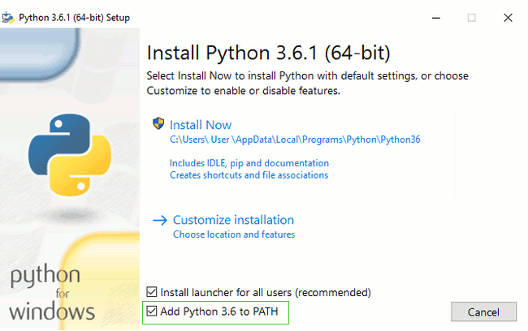


.. _myinstallation:

#######################
Installation von Python
#######################

Python gibt es in zwei Versionen, die nicht kompatibel sind, insbesondere können
Programme, die für *Python2* geschrieben wurden, im Normalfall nicht von *Python3* verwendet werden.
Wir werden hier eine aktuelle **Python3.x** Version benutzen.

*Python* ist OpenSource und kostenlos und die Installation auf dem eigenen Rechner ist 
ganz einfach. Das Original, in allen Versionen und für alle Betriebssysteme
gibt es auf `www.python.org <https://www.python.org/downloads>`_.

.. _myinstallation-hint:

**Wichtig** ist nur, dass bei einer Installation unter Windows die **Option** ausgewählt wird,
mit der Python auch auf der *Windows-Kommandozeile* ausgeführt werden kann.
Dazu muss ein Kästchen mit einer Bezeichnung wie "Add Python 3.x to PATH" oder "Add Python to
your environment variables" ausgewählt werden.

Auf Apple Computern und auch auf Linux muss eventuell noch die graphische Komponente (Tk)
installiert werden, die z.B für die (Mini)Entwicklungsumgebung IDLE benötigt wird.
Die Installation auf den verschiedenen Betriebssystemen ist übrigens auch wieder sehr gut
in den Tutorials der `Django Girls <https://tutorial.djangogirls.org/de/installation/#python>`_ erklärt.

Aus andere Quellen
------------------

Python kann aber auch als Teil von :ref:`Thonny <thonny_ide>` oder
:ref:`Anaconda <anac_ide>` installiert werden.
Während `Thonny` die einfachste Alternative zu einer Standard-Installation darstellt, 
ist `Anaconda` sehr viel umfangreicher und für den Einstieg nicht so geeignet.
