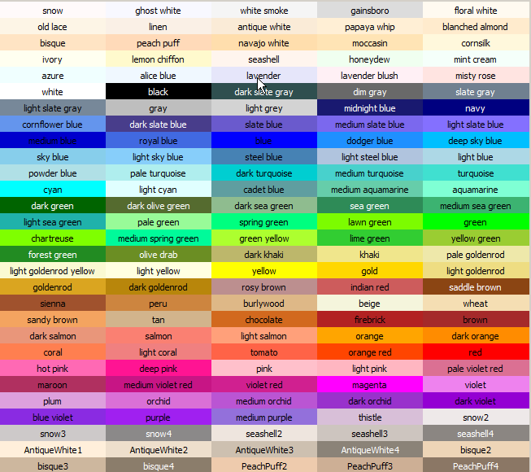


.. index:: turtle, farben 

###################
Turtle - Funktionen
###################

Die Einstiegsvariante der Turtle Software ist prozedural,
d.h. hier werden einfach nur Funktionen verwendet.

Wir kennen schon die Funktion ``forward(pixel)``. Andere Funktionen mit denen der Stift relativ zur aktuellen Position und Richtung bewegt werden kann sind z.B:
``left(90)``, dabei dreht sich die Turtle um 90 Grad nach links,
und mit ``right(grad)`` entsprechend nach rechts.
Mit ``circle(180)`` wird ein Halbkreis gezeichnet.

Auch die Form und Aussehen lässt sich ändern.
Mit ``width(3)`` beträgt die Strichbreite 3 Pixel und mit
``color("red")`` bekommen Stift und Strich die Farbe rot.
Wir probieren auf der :ref:`Python-Shell<python-shell>`:

.. code:: python

    from turtle import *

    shape("circle")
    color("red")
    width(3)
    left(45)
    forward(100)

Schon nach der Eingabe von  ``shape`` öffnet sich ein neues Fenster und der Zeichenstift wird in der gewünschten Art angezeigt
('arrow', 'turtle', 'circle', 'square', 'triangle', 'classic').

Mit der Funktion ``up`` wird der Zeichenstift angehoben und damit auch nicht
mehr gezeichnet, nur noch die Spitze des Stifts wird angezeigt.
Mit ``down``  wird der Stift wieder abgesenkt und danach weitergezeichnet.

Es kann aber auch mit Koordinaten gearbeitet werden, so liefert ``xcor`` die X-
und ``ycor`` die Y-Kooridinate. Mit ``goto(x,y)`` wird der Stift zu der angegebenen
Position gefahren.

Dann gibt es auch noch Funktionen, die sich statt auf den Stift, auf die Zeichenfläche 
oder das Fenster beziehen. So erhalten wir mit ``setup(500,300)`` ein Fenster mit der Breite von 500 und der Höhe von 300 Pixeln.

Soll die Nullpunkt des Koordinatenkreuzes, statt in der Mitte, in der 
unteren linken Ecke sein, kann das folgendermaßen eingestellt werden:

.. code:: python

    from turtle import *

    # Die Größe des Fensters festlegen.
    setup(500,300)

    # den Nullpunkt verschieben
    setworldcoordinates(0,0,500,300)

Außerdem kann durch das Drücken einer Taste
eine Funktion aufgerufen werden:

.. code:: python

    from turtle import *

    def run():
        forward(50)

    # die Taste 'r' ruft die Funktion mit dem Namen `run`  auf
    onkey(run, "r")
    listen()
    mainloop()

Hier noch einige Bezeichnungen für Farben, die in der
Funktion ``color`` verwendet werden können.

