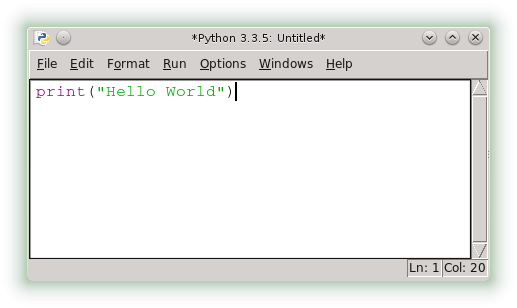

.. _tutorial-werkzeuge:

.. index:: Python, Code, Editor, Code-Editor, IDE, IDLE, Thonny

#########
Werkzeuge
#########

Python
------

Mit Python sind eigentlich zwei Sachen gemeint:
Zum einen ist es die Programmiersprache *Python*
zum anderen ist es das Programm ``python``.

Wird das Programm ``python`` einfach so aufgerufen, sieht das doch
ziemlich wie ein :ref:`Kommandozeilenprogramm <cmd-line>` aus !?

Und richtig, es ist die sogenannte :ref:`Python-Shell<python-shell>`.

Der Prompt besteht aus "3 Größerzeichen"  **>>>**  und ist das
Erkennungszeichen dafür, dass hier nur Befehle oder Anweisungen verstanden werden,
die den Regeln der Programmiersprache `Python` entsprechen:

.. code:: python

    Python 3.xxx
    >>> 

Falls der eingegebene Befehl kein gültiger Python-Code ist, erhalten wir eine Fehlermeldung.
Auf den ersten Blick sieht das etwas furchterregend aus, aber es sind nur Hinweise darauf
was vom Python Interpreter nicht verstanden wurde.

.. _code-editor:

Code-Editor
-----------

Zum Programmieren ist auch immer ein Editor notwendig, das ist das Programm
mit dem der eigentliche Programmtext geschrieben wird.
Der Programmtext, also der (Programm)Code, besteht nur aus 'plain Text', d.h. der 
Text enthält keine Formatierungen, wie wir es aus einer Textverarbeitung
wie MS-Word / Libreoffice etc. kennen.
Und `auch hier <https://tutorial.djangogirls.org/de/code_editor>`_
gibt es zu diesem Thema wieder eine gute Beschreibung.
Wir brauchen hier aber keinen extra Editor, da wir den aus
der IDLE verwenden.

.. _idle:

IDLE
----

Zum Programmieren sind immer mehrere Programmwerkzeuge notwendig, häufig werden diese
Werkzeuge zu einer sogenannten *Entwicklungsumgebung* zusammengefasst.
Der allgemeinen Abkürzung dafür heißt IDE und steht für
`Integrierte Entwicklungsumgebung <https://de.wikipedia.org/wiki/Integrierte_Entwicklungsumgebung>`_,
Für Python gibt es eine Reihe von IDE's, eine - nämlich die *IDLE* ist 
ein fester Bestandteil einer Python Installation.

Die *IDLE* ist im Vergleich zu anderen IDE's eine ziemlich einfache *Entwicklungsumgebung*,
aber sie enthält einen für Python gut geeigneten Code-Editor und  
ist für unsere Anforderungen gut geeignet.

Wenn wir nun die *IDLE* gestartet haben, öffnet sich als erstes ein Fenster
mit der Bezeichnung "Python Shell". Das ist prinzipiell die gleiche
`Interaktive Umgebung`, wie wenn wir ``python`` direkt aufgerufen hätten.

.. _python-shell:

Python-Shell
^^^^^^^^^^^^

Die Python-Shell ist, wie Du vielleicht schon erkannt hast, ein :ref:`Kommandozeilenprogramm <cmd-line>`
mit dem interaktiv mit Python gearbeitet werden kann.

Das Erkennungszeichen ist der Prompt mit den drei "Größer Zeichen" **>>>**.

.. figure:: pics/idle_01.png
    :align: left
    :figwidth: 100%

Gegenüber dem "rein interaktiven" ``python`` gibt es noch ein paar Erweiterungen. 
Z.B. können zuvor eingegebene Befehle mit :kbd:`<Alt>+p` reaktiviert 
und gegebenenfalls auch abgeändert werden.

Programmieren
^^^^^^^^^^^^^

Bevor wir mit dem Programmieren anfangen können, müssen wir unter `MS-Windows`
ein **eigenes Verzeichnis** für unsere Programme erstellen. Das kann irgendwo sein, aber nicht
im Verzeichnisbaum der eigentlichen Python-Software. 
Ein Ordner mit dem Namen `python` unterhalb von `Dokumenten` wäre eine gute Möglichkeit.

Um ein Programm zu erstellen brauchen wir als erstes einen :ref:`Editor<code-editor>`.
Wir wechseln zur Python-Shell zurück und rufen im Menü unter *File* den Unterpunkt *New File* auf.
Damit erhalten wir ein neues Fenster, - das Editorfenster, in das wir unsere Programmanweisungen schreiben können .

Im Kopfteil des Fensters steht noch „Untitled*“, da der Inhalt des Editorfensters noch nicht in einer Datei gespeichert wurde.
Nachdem ich meinen Programmtext  (Programm Code) eingegeben habe, speichere ich ihn in einer Datei ab.
Dies geschieht wieder im Menü unter *File* und dann dem Unterpunkt *Save*. Dort wählen wir den eben erstellten Ordner
aus und vergeben einen passenden Dateinamen, wie z.B. ``hello.py``.
Der gewählte Dateiname und das Verzeichnis werden danach in der Kopfzeile des Editorfensters angezeigt.

.. figure:: pics/idle_03.png
    :align: left
    :figwidth: 100%

Jetzt müssen wir unser Programm nur noch ausprobieren. Dazu öffne ich im Editor Fenster 
Menü unter *Run* den Unterpunkt *Run Module*. 
Alle Ausgaben des Programms werden jetzt im Fenster mit der „Python Shell“ angezeigt, dort steht
jetzt also "Hello World". Und sollte es einen Fehler gegeben haben,
wird die Fehlermeldung ebenfalls in diesem Fenster ausgegeben.

Nachdem die Datei einmal erstellt wurde, können wir den geänderten Programmcode mit der :kbd:`<F5>`-Taste
in einem Rutsch speichern und das Programm starten.

.. _thonny_ide:

THONNY
------

Eine neue und gute Alternative zur :ref:`IDLE<idle>` ist die Entwicklungsumgebung (IDE) `Thonny`.
Die Oberfläche ist einfach und intuitiv zu bedienen und insgesamt
aufgeräumter. Ein besonderer Vorteil ist der gut funktionierende Debugger.
Die grundlegenden Abläufe beim Programmieren entsprechen dann dem was bei der IDLE 
besprochen wurde.

`Thonny` basiert wie die `IDLE` auf der Grafikbibliothek `Tk`, ist aber
erst ab der Python Version 3.8 verfügbar.

Installieren
^^^^^^^^^^^^

Die `Installation von Thonny <https://thonny.org/>`_  enthält auch die Python Software.
Es ist aber auch möglich `Thonny` zu einer bestehenden Python Installation nachträglich hinzuzufügen.
Hierfür muss die :ref:`Windows Kommandozeile <cmd-line>` (bzw. unter Mac-OS/Linux ein Terminal)
geöffnet werden und von dort wird Thonny mit pip/(pip3) installiert:

.. code-block:: text
    
    C:\USERS\OLA>pip install thonny

danach kann ``thonny`` direkt von der Kommandozeile aus gestartet werden:

.. code-block:: text
    
    C:\USERS\OLA>thonny
