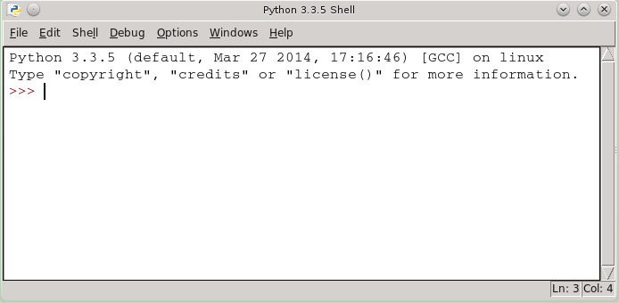
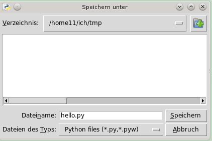

.. _tutorial-werkzeuge:

.. index:: Python, Code, Editor, Code-Editor, IDE, IDLE

#########
Werkzeuge
#########

Python
------

Mit Python sind eigentlich zwei Sachen gemeint:
Zum einen ist es die Programmiersprache *Python*
zum anderen ist es das Programm ``python``.

Wird das Programm ``python`` einfach so aufgerufen, 
sieht das doch ziemlich wie ein :ref:`Kommandozeilenprogramm <cmd-line>` aus.

Und richtig, es ist die sogenannte :ref:`Python-Shell<python-shell>`.

Der Prompt besteht aus "3 Größerzeichen"  **>>>**  und ist das
Erkennungszeichen dafür, das hier nur noch Befehle oder Anweisungen verstanden werden,
die den Regeln der Programmiersprache `Python` entsprechen:

.. code:: python

    Python 3.xxx
    >>> 

Falls der eingegebene Befehl kein gültiger Python-Code ist, erhalten wir eine 
Fehlermeldung.
Auf den ersten Blick sieht das dann schlimmer aus, als es ist, 
denn es sind nur Informationen, um zu erkennen was schief gelaufen ist.

.. _code-editor:

Code-Editor
-----------

Zum Programmieren ist auch immer ein Editor notwendig, das ist das Programm
mit dem der eigentliche Programmtext geschrieben wird.
Der Programmtext, also der Code, besteht nur aus 'plain Text', d.h. der 
Text enthält keine Formatierungen, wie wir sie aus einer Textverarbeitung
wie MS-Word / Libreoffice etc. kennen.
Und `auch hier <https://tutorial.djangogirls.org/de/code_editor>`_
gibt es zu diesem Thema wieder eine gute Beschreibung.
Wir brauchen hier aber keinen extra Editor, da wir den aus
der IDLE verwenden.

IDLE
----

Zum Programmieren sind immer mehrere Programmwerkzeuge notwendig, häufig werden diese
Werkzeuge zu einer sogenannten *Entwicklungsumgebung* zusammengefasst.
Der allgemeinen Akbkürzung dafür heißt IDE und steht für
`Integrierte Entwicklungsumgebung <https://de.wikipedia.org/wiki/Integrierte_Entwicklungsumgebung>`_,
Für Python gibt es eine Reihe von IDE's, eine - nämlich die *IDLE* ist 
ein fester Bestandteil einer Python Installation.

Die *IDLE* ist im Vergleich zu anderen IDE's eine ziemlich einfache *Entwicklungsumgebung*,
aber sie enthält einen für Python gut geeigneten Code-Editor und  
ist für unsere Anforderungen gut geeignet.

Wenn wir nun die *IDLE* gestartet haben, öffnet sich als erstes ein Fenster mit der 
Bezeichnung "Python Shell". Das ist prinzipiell die gleiche Interaktive Umgebung, wie wenn 
wir ``python`` direkt aufgerufen hätten.

.. _python-shell:

Python-Shell
^^^^^^^^^^^^

Die Python-Shell ist, wie Du vielleicht schon erkannt hast, ein :ref:`Kommandozeilenprogramm <cmd-line>`
mit dem inaktiv mit Python gearbeitet werden kann.

Das Erkennungszeichen ist der Prompt mit den drei "Größer Zeichen" **>>>**.

Gegenüber dem "rein interaktiven" ``python`` gibt es noch ein paar Erweiterungen. 
Z.B. können zuvor eingegebene Befehle mit :kbd:`<Alt>+p` reaktiviert 
und gegebenenfalls auch abgeändert werden.

Programmieren
^^^^^^^^^^^^^

Zum Programmieren starten wir als erstes den :ref:`Editor<code-editor>`.
Dazu rufen wir im Menu unter *File* den Unterpunkt *New File* aus
und erhalten dann ein neues Fenster, das Editorfenster, und können dann dort unsere Programmanweisungen reintippen.

.. figure:: pics/idle_02.png
    :align: left
    :figwidth: 100%

Im Kopfteil des Fensters steht noch „Untitled*“, da der Inhalt
des Editorfensters noch nicht in einer Datei gespeichert wurde.
Nachdem ich meinen Programmtext  (Programm Code) eingegeben habe, speichere ich ihn in einer Datei ab.
Dies geschieht wieder im Menu unter *File* und dann dem Unterpunkt *Save*. Das es ja eine neue Datei war,
wählen oder erstellen wir ein Verzeichniss und geben dann einen passenden Dateinamen ein.
Der gewählte Dateiname steht jetzt in der Kopfzeile des Editorfenster.

Jetzt müssen wir unser Programm nur noch ausprobieren. Dazu öffne ich im Editor Fenster 
Menu unter *Run* den Unterpunkt *Run Module*. 
Alle Ausgaben des Programms werden jetzt im Fenster mit der „Python Shell“ angezeigt, dort steht
jetzt allso "Hello World". Sollte es einen Fehler gegeben haben, und was ich immer wieder betonen muss:
"Fehler sind unsere Freunde", werden sie ebenfalls in diesem Fenster ausgegeben.

Nachdem die Datei einmal erstellt wurde, können wir den geänderten Programmcode mit der F5-Taste 
fast in einem Rutsch speichern und das Programm starten.
